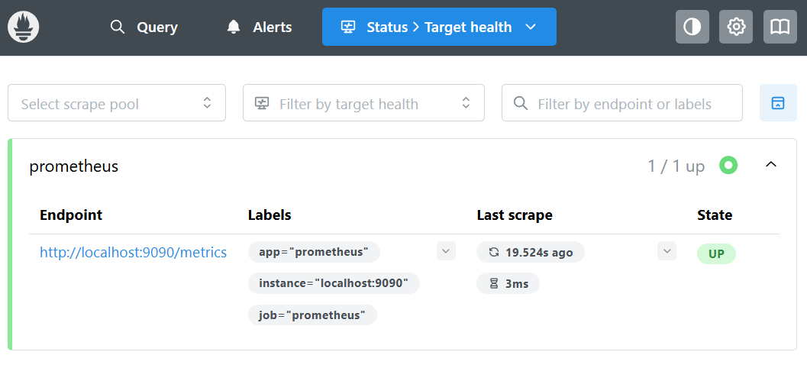

# TP Observabilité — Exercice 1 : Installer Prometheus

## Objectif
Lancer Prometheus en conteneur Docker et vérifier qu'il se scrape lui-même.

## Commandes exécutées

```bash
docker pull prom/prometheus:latest
docker run -d --name prometheus -p 9090:9090 prom/prometheus:latest
docker logs prometheus
```

## Résultats observés

- Interface accessible sur http://192.168.1.72:9090
- Cible `prometheus` visible dans `Status > Targets` avec statut **UP**

- Répertoire de stockage n'était pas visible dans les logs mais il correspnds à : `path=/prometheus`

## Difficultés rencontrées
Le chemin de stockage n'été pas visible dans les logs j'ai executé cette commande afin de l'obtenir

```bash
docker inspect prometheus | grep -A5 "Mounts"
        "Mounts": [
            {
                "Type": "volume",
                "Name": "251f3e2ed9204b494a9b84e11f64c296386e0ec2b94fd75d0e0bdefff66dc108",
                "Source": "/var/lib/docker/volumes/251f3e2ed9204b494a9b84e11f64c296386e0ec2b94fd75d0e0bdefff66dc108/_data",
                "Destination": "/prometheus",
```

## Conclusion
Prometheus est opérationnel et se scrape lui-même, validant le bon fonctionnement du pipeline de collecte de métriques.
