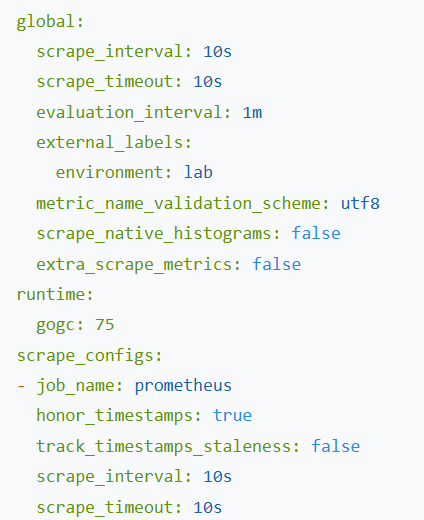
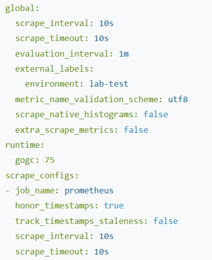

# TP Observabilité — Exercice 2 : Premier prometheus.yml

## Objectif
Configurer Prometheus avec un fichier personnalisé et tester le rechargement à chaud.

## Commandes exécutées

```bash
docker rm -f prometheus
# [contenu du prometheus.yml]
docker run -d --name prometheus -p 9090:9090 \
  -v $(pwd)/prometheus.yml:/etc/prometheus/prometheus.yml \
  prom/prometheus:latest \
  --config.file=/etc/prometheus/prometheus.yml \
  --web.enable-lifecycle
curl -X POST http://localhost:9090/-/reload
```

## Résultats observés

- `scrape_interval: 10s` visible dans `Status > Configuration`
- `environment: lab` visible dans `Status > Configuration`

- Rechargement à chaud avec la commande `curl -X POST http://localhost:9090/-/reload`
- Modification prise en compte sans redémarrage


## Conclusion
La configuration personnalisée est opérationnelle et le rechargement à chaud via l'API lifecycle fonctionne correctement.
