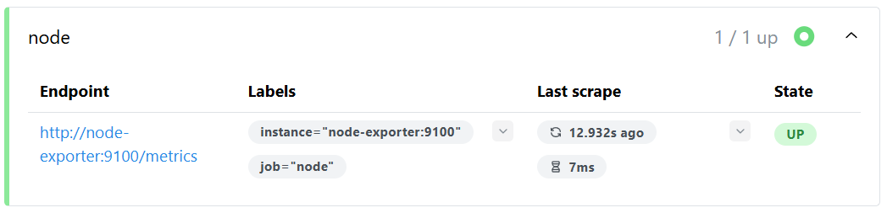
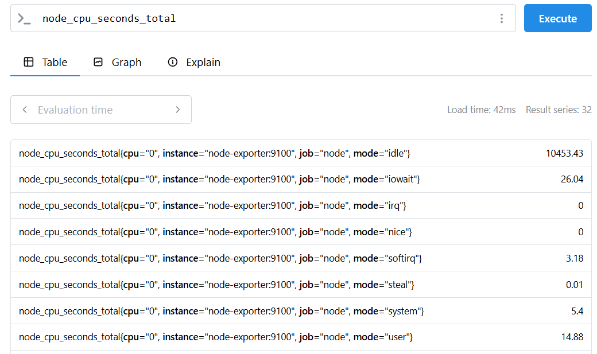

# TP Observabilité — Exercice 3 : node_exporter et métriques système

## Objectif
Lancer node_exporter et configurer Prometheus pour scraper les métriques système.

## Commandes exécutées

```bash
docker run -d --name node-exporter -p 9100:9100 prom/node-exporter:latest
docker network create monitoring
docker network connect monitoring prometheus
docker network connect monitoring node-exporter
curl -X POST http://localhost:9090/-/reload
```

## Contenu du prometheus.yml

```yaml
global:
  scrape_interval: 10s
  external_labels:
    environment: lab

scrape_configs:
  - job_name: 'prometheus'
    static_configs:
      - targets: ['localhost:9090']

  - job_name: 'node'
    static_configs:
      - targets: ['node-exporter:9100']
```

## Résultats observés

- [ ] node_exporter accessible sur http://192.168.1.72:9100/metrics
- [ ] Cible `node` visible dans `Status > Targets` avec statut **UP**

- [ ] Métrique `node_cpu_seconds_total` visible dans l'expression browser



## Conclusion
node_exporter est opérationnel et Prometheus scrape correctement les métriques système de l'hôte.