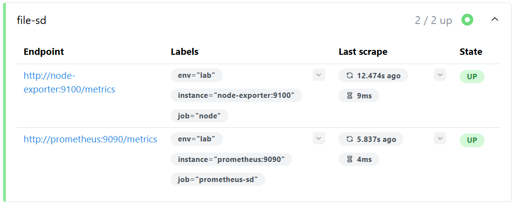
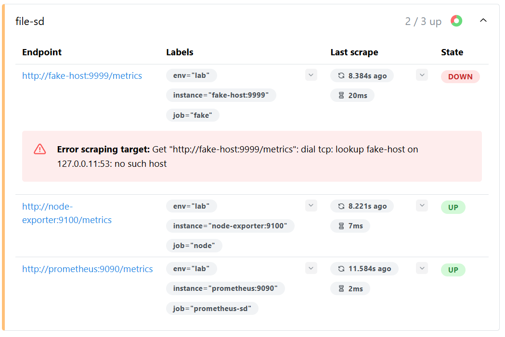

# TP Observabilité — Exercice 4 : Découverte de service par fichier

## Objectif
Remplacer les static_configs par file_sd_configs pour une découverte dynamique des cibles.

## Commandes exécutées

```bash
docker rm -f prometheus
docker run -d --name prometheus --network monitoring -p 9090:9090 \
  -v $(pwd)/prometheus.yml:/etc/prometheus/prometheus.yml \
  -v $(pwd)/sd:/etc/prometheus/sd \
  prom/prometheus:latest \
  --config.file=/etc/prometheus/prometheus.yml \
  --web.enable-lifecycle
```

## Contenu de targets.json

```json
[
  {
    "targets": ["node-exporter:9100"],
    "labels": {
      "job": "node",
      "env": "lab"
    }
  },
  {
    "targets": ["prometheus:9090"],
    "labels": {
      "job": "prometheus-sd",
      "env": "lab"
    }
  }
]
```

## Résultats observés

- Cibles issues du JSON visibles dans `Status > Targets`

- Ajout d'une cible dans le JSON détecté sans rechargement (< 5s)

- Suppression d'une cible détectée sans rechargement en retirant la target fake-host :
```json
 {
    "targets": ["fake-host:9999"],
    "labels": { "job": "fake", "env": "lab" }
  }
```

## Conclusion
La découverte par fichier permet une gestion dynamique des cibles sans interruption ni rechargement de Prometheus.