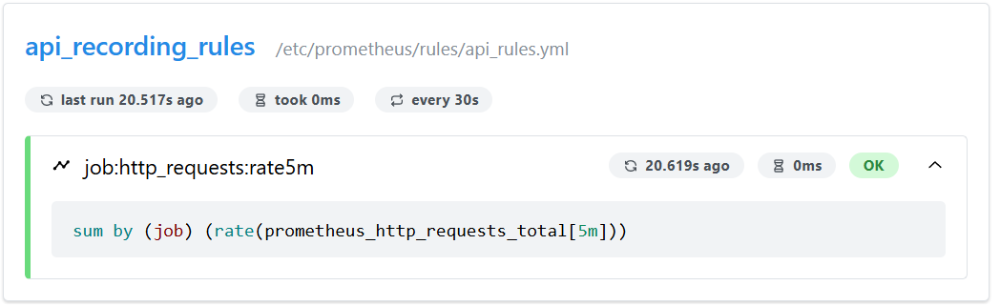
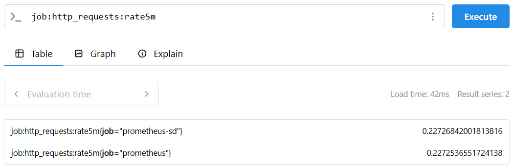

# TP Observabilité — Exercice 5 : Recording Rules

## Objectif
Pré-calculer une requête PromQL coûteuse via une recording rule et l'interroger comme une métrique native.

## Commandes exécutées

```bash
docker rm -f prometheus
docker run -d --name prometheus --network monitoring -p 9090:9090 \
  -v $(pwd)/prometheus.yml:/etc/prometheus/prometheus.yml \
  -v $(pwd)/sd:/etc/prometheus/sd \
  -v $(pwd)/rules:/etc/prometheus/rules \
  prom/prometheus:latest \
  --config.file=/etc/prometheus/prometheus.yml \
  --web.enable-lifecycle
```

## Contenu de rules/api_rules.yml

```yaml
groups:
  - name: api_recording_rules
    interval: 30s
    rules:
      - record: job:http_requests:rate5m
        expr: sum by (job) (rate(prometheus_http_requests_total[5m]))
```

## Résultats observés

- Règle visible dans `Status > Rules` avec état **OK**

- Métrique `job:http_requests:rate5m` retourne des données dans l'expression browser


## Conclusion
La recording rule pré-calcule et stocke le taux de requêtes HTTP, rendant les requêtes Grafana instantanées.