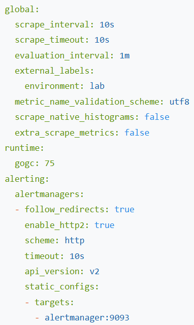
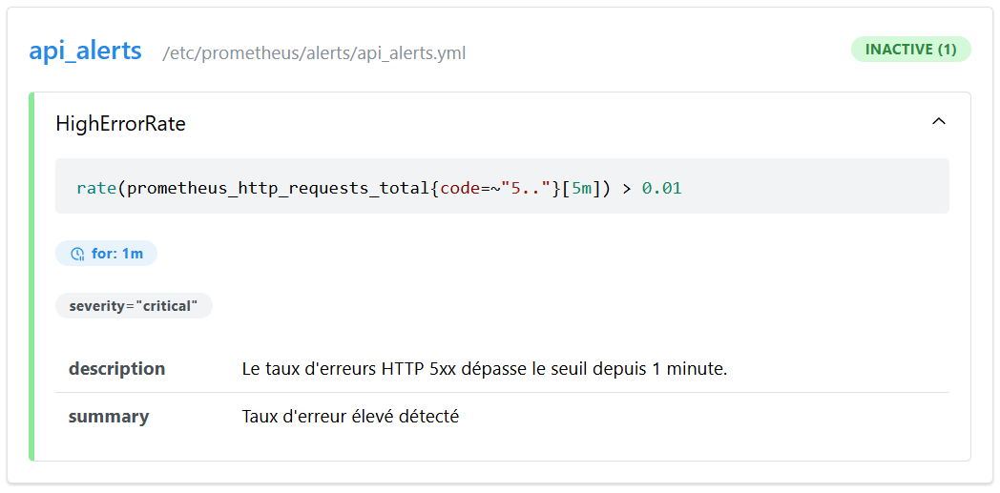
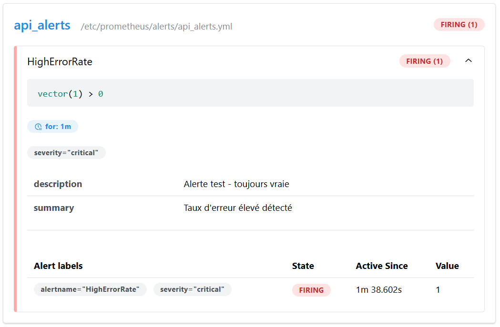

# TP Observabilité — Exercice 6 : Règles d'alerte et Alertmanager

## Objectif
Définir une règle d'alerte dans Prometheus et la router vers Alertmanager.

## Commandes exécutées

```bash
docker run -d --name alertmanager --network monitoring -p 9093:9093 \
  -v $(pwd)/alertmanager/alertmanager.yml:/etc/alertmanager/alertmanager.yml \
  prom/alertmanager:latest

docker rm -f prometheus
docker run -d --name prometheus --network monitoring -p 9090:9090 \
  -v $(pwd)/prometheus.yml:/etc/prometheus/prometheus.yml \
  -v $(pwd)/sd:/etc/prometheus/sd \
  -v $(pwd)/rules:/etc/prometheus/rules \
  -v $(pwd)/alerts:/etc/prometheus/alerts \
  prom/prometheus:latest \
  --config.file=/etc/prometheus/prometheus.yml \
  --web.enable-lifecycle
```

## Contenu des fichiers clés

```yaml
# alerts/api_alerts.yml
groups:
  - name: api_alerts
    rules:
      - alert: HighErrorRate
        expr: vector(1) > 0
        for: 1m
        labels:
          severity: critical
        annotations:
          summary: "Taux d'erreur élevé détecté"
          description: "Alerte test - toujours vraie"
```

## Résultats observés

- `Status > Configuration` le bloc `alertmanagers` est visible

- Alerte `HighErrorRate` visible dans `Status > Alerts`

- Alerte passée en état **Firing** après déclenchement

- Alerte visible dans l'interface Alertmanager sur http://192.168.1.72:9093

## Conclusion
Prometheus évalue la règle d'alerte et route les alertes actives vers Alertmanager, validant le pipeline d'alerting de bout en bout.